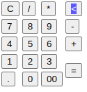
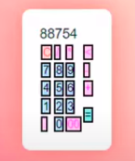
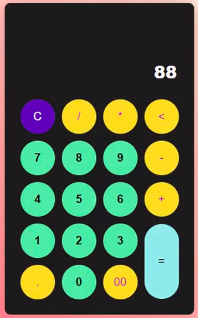
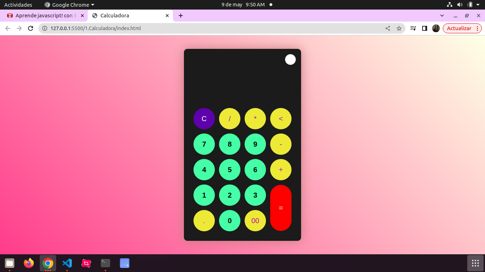
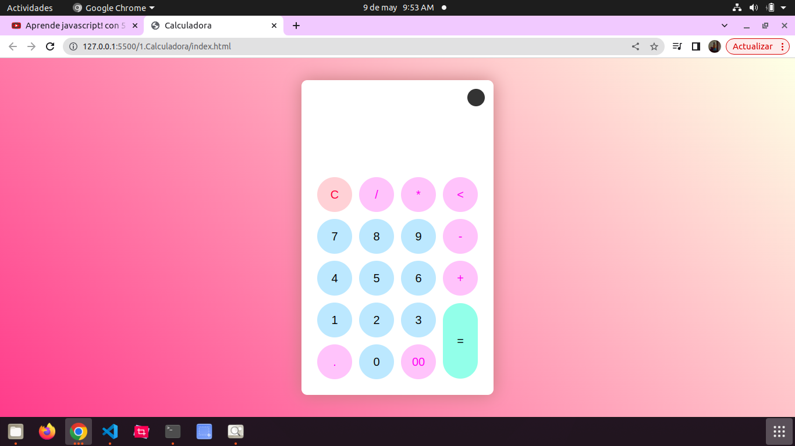

Bueno en este video nos explica que Javascript es una herramienta muy usada y muy buena. Ahra nos va a dar unos ejercicios y teorema.

# ¿Qué es Javascript?
Javascript fue creado por Brendan Eich en el año 1995, se dice que o creo en 10 días, Javascript es un lenguaje de programación orientado a web.

## PRIMER EJERCICIOS LA CALCULADORA.

- La calculadora es muy util para poder afianciar todos los conocimientos que hemos adquerido, siendo muy practico para aprender cualquier lenguaje.

- en la carpeta index.thml es donde vamos crear el esqueleto de la calculadora y utilizaremos la herramienta div que es un contenedor y sirve para organizar las cosas y también usaremos display que es para poder dar a la vista como filas agregadas, id es un identificador y un determinado comportamiento pero no se pueden repetir deben ser unicos, como también vamos a usar botones para la calculadora y le agregaremos un lenguaje matematico que serian multiplicación, resta, división y suma.

-la carpeta script.js:ahora definimos la constante, identificando la display y los botones haciendo que reconozca todos los botones para darle una función específica, ahora se hace un arreglo, con ítem podemos identificar todos los botones cual es: 1,2,3 y así, los botones tienen onclick que es cuando uno le da click, también le vamos agregar condicionales "if", "else if", usaremos substr en Javascript devuelve las caracteres de una cadena que comienza en una localización específica tiene un parámetro de inicio y de longitud, los caracteres tiene que comenzar de 0 en longitud es menos 1 en resumen esta función nos va a extraer el último carácter.Lo que hacemos en esta carpeta es definir cada herramienta que estamos usando sea identificada y darle un función específica. 

Style.sccs: En está carpeta lo que vamos a hacer cómo nos explica el video es que estaremos formando el cuerpo y eso será lo que las personas van a ver desde sus pantallas, como también le daremos la decoración a boton o a la costante que hemos definido dando le color y forma.

 Luego de esto le añadiremos colores y contextura a las herramientas que hemos estado usando dando le estilo, detalles y dando le bordes, como también altura y un ancho definida y agregandole flex que es para que sea flexible a los lados, ademas arreglando estilo a las letras.

Ahora vamos implementar el modo oscuro y claro utilizando la variable constante, ademas modificaremos el icono 

Luego le vamos a añadir el icono para la ventana de la calculadora para eso la vamos a descar de una pagina web 